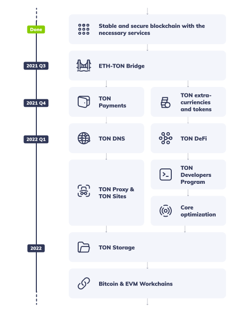

# FAQ for chats

## Общеобразовательная информация

### Что такое блокчейн?

Давайте в самых простых словах разберём эту технологию и выясним, почему её называют интернетом будущего.

**Где "находится" сегодняшний интернет?**

Он хранится на серверах. Например, YouTube-ролики хранятся на серверах Google. Информация о ваших обедах и ужинах — на серверах Delivery Club. Ваши паспортные данные — на серверах Госуслуг. Сервера — это некие "центры", хранящие, обрабатывающие и передающие информацию

Технология блокчейн позволяет полностью избавиться от таких центров и сделать интернет децентрализованным — поэтому его называют интернетом будущего, или Web 3.0.

**Как это работает:**

В дословном переводе blockchain — "цепочка блоков". Вся информация записывается в блоках, а создают их и обслуживают майнеры. Цепочка одновременно хранится на компьютерах огромного количества независимых пользователей, а не на серверах организаций.

Попробуем визуализировать: у вас есть флешка с любимыми фотографиями. Эта флешка внезапно "сгорает". Ваши фото утеряны навсегда. В блокчейне такая ситуация исключена, потому что существуют сотни тысяч людей с такими же "флешками", и уничтожение одной из них ни на что не влияет.

Блоки невозможно удалить или изменить \(в отличие от обычных баз данных\). Если какая-то информация появилась в блоке, она останется там навсегда. Каждый новый блок содержит ссылку на предыдущий, поэтому действия внутри сети можно отследить в любой момент.

Например, некто передал вам один TON Coin. А вы передали эту монету своему лучшему другу. Все эти сделки записаны на огромном количестве компьютеров, они незыблемы, и право владения монетой навсегда останется за ваших другом \(если только он сам её кому-то не передаст\)

Децентрализованные экосистемы открывают массу возможностей! В мире существует множество блокчейнов, и они почти никак не связаны ни друг с другом, ни с централизованным миром. Цель TON — объединить их в единую экосистему, и создать настоящий Web 3.0.

### Что такое блокчейн-экосистема?

Существует множество блокчейнов, и они конкурируют. Чтобы перетянуть пользователей, каждая сеть старается разработать вокруг себя полноценную экосистему — своеобразный "набор" децентрализованных сервисов и приложений.

Они очень похожи на привычные нам, только лучше =\)

**Например, в развитой экосистеме вы сможете:**

* Проводить любые платежи почти моментально.
* Платить минимальные комиссии за транзакции \(или не платить их вообще\).
* Токенизировать свой паспорт и пользоваться государственными услугами прямо в смартфоне: брать кредит, регистрировать брак и пр.
* Покупать и продавать элементы Digital искусства, игровые предметы.
* Обезопасить свои активы — все сделки записаны в цепочке блоков. Если вы приобрели монету, ни один мошенник не сможет доказать, что она принадлежит ему, а не вам.
* Рассчитывать на 100% анонимность: в сделках не указываются персональные данные, а только номера криптокошельков.
* В будущем — совершать сделки не только с криптовалютой, но и с любыми токенизированными активами: хоть с акциями, недвижимостью или мебелью.
* Избегать посредников. Люди передают активы напрямую друг другу, минуя организации.

То есть, сможете делать то же самое, что раньше — только быстрее, надёжнее, дешевле и безопаснее.

Команда TON Foundation преследует потрясающую цель — объединить все существующие блокчейны в единую сеть. Подобную экосистему можно смело назвать интернетом будущего — Web 3.0, без всяких преувеличений.

### Что такое майнинг?

Вы знаете, что в блокчейне нет единого центра/сервера, хранящего информацию. Все данные хранятся в блоках, которые выстраиваются в "цепочку". Возникает закономерный вопрос: а откуда эти блоки вообще берутся?

**Отвечаем: благодаря майнингу** — компьютерным вычислениям, которые позволяют создать новый блок.

Грубо говоря, это выглядит так: вы покупаете компьютер, подключаетесь к сети, и мощность компьютера "обслуживает" нужды блокчейна. Обрабатывает транзации, хранит информацию, и пр. Сеть блокчейн существует благодаря майнерам. Чем их больше, тем стабильнее сеть. И именно майнеры создают новые блоки по заданным стандартам.

**За работу они получают вознаграждение** — как правило, в виде криптовалюты данного блокчейна. Майнить малоизвестные, непопулярные монеты — легко. Вам не понадобится мощное железо, справится даже ваш ПК.

Однако, если монета дорожает, ситуация меняется. Майнинг этой валюты становится куда более выгодным, и в сеть приходят десятки и сотни тысяч новых майнеров, конкуренция между ними растёт. Увеличивается и требуемая мощность. 

Тогда появляются майнинговые фермы. Ферма — это набор из нескольких устройств для майнинга. Бывают домашние фермы, а бывают крупные — огромные пространства, заставленные профессиональным оборудованием.

С появлением таких мощностей майнинг в домашних условиях становится невозможным. Так было с биткоином: в 2009 году его майнили на домашних процессорах энтузиасты, и их было всего несколько сотен человек. Сейчас в мире насчитывается более 1 млн майнеров Bitcoin.

**Резюме:**

* В блокчейне нет никакого центрального сервера, который обрабатывает информацию. Вся информация хранится в блоках, которые создают и обслуживают майнеры.
* Чем больше майнеров — тем стабильнее блокчейн.
* За свою работу майнеры получают вознаграждение в виде криптовалюты данного блокчейна.
* Чем популярнее монета, тем сложнее, дороже и энергозатратнее её майнить.

Всё вышесказанное справедливо для **Proof-of-Work блокчейнов**. Также существуют Proof-of-Stake блокчейны \(такие, как TON\), которым для работы сети майнинг не нужен.

### Что такое Proof-of-Work \(PoW\)?

Это доминирующий алгоритм среди крупнейших криптовалют. Его используют Bitcoin, Ethereum, Litecoin, Dogecoin, Bitcoin Cash и Monero.

**Как он работает:**

Оборудование майнера решает криптографическую задачу, которую перед ним ставит блокчейн. В частности, так появляются новые блоки в цепи: железо должно "разгадать" задачу, чтобы иметь возможность создать следующий блок.

Разгадывание — это простейший перебор миллионов комбинаций кода, требующий однако огромных вычислительных мощностей и создающих доказательство “работы”. Доказательством “работы” же служит уникальное значение \(хэш\).

Как только майнер его находит, он отправляет хэш другим компьютерам сети на проверку. Другие участники могут верифицировать хэш на соответствие поставленной задаче, но не использовать его для создания блока. Ключ разгадки хэша принадлежит майнеру, что его создал

Особенность хэша в его асимметрии — он достаточно сложен для нахождения майнеру, но прост для проверки остальным участникам сети на соответствие. При этом каждый хэш несет в себе информацию предыдущих блоков сети. Тем самым образуется подтверждение, что все действия были произведены в рамках одного блокчейна.

**Давайте визуализируем:**

Допустим, вы знаете номер выигрышного билета в лотерее: 351. Было бы неплохо подойти к кассе и попросить билет с этими номерами. Но вы не можете, поскольку билеты выдаются случайным образом. Все, что вы можете сделать — заплатить за билет и надеяться, что получите счастливое число: 351. Если нет - не повезло. Купите другой билет и попробуйте снова.

Хорошая новость заключается в том, что вы можете пробовать столько раз, сколько хотите. Плохая новость заключается в том, что вам придется платить за каждый новый билет.

В лотерее каждый игрок надеется, что он получит выигрышный номер раньше других. Аналогично, каждый майнер надеется, что он сможет создать “выигрышный” хэш раньше других майнеров.

Если майнер нашёл правильный "ответ" первым — он получает вознаграждение в виде криптовалюты блокчейна.

**Какие у PoW минусы:**

* Первый недостаток - вред экологии. Майнинг поглощает чудовищное количество электроэнергии. Компьютеры быстро изнашиваются, на замену им приходят новые, а старые выбрасываются — так возникают целые свалки деталей.
* Второй недостаток - защита. Proof of Work обеспечивает достаточный уровень безопасности только при наличии большой группы майнеров, конкурирующих за вознаграждение за блок. Если сеть небольшая, остается возможность того, что хакер может получить простое большинство вычислительной мощности и реорганизовать блоки по своему усмотрению. Это также называется атакой 51%.

Существует альтернативный алгоритм консенсуса PoS \(Proof-of-Stake\). Он лишён этих двух минусов, и выглядит более справедливой моделью.

### Что такое **Proof-of-Stake \(**PoS\)?

Алгоритм консенсуса Proof-of-Work имеет главный минус — модель НЕ экологична, поскольку чудовищно энергозатратна.

Алгоритм PoS \(Proof-of-Stake\) лишён этого недостатка. Работоспособность PoS-блокчейна поддерживают валидаторы — владельцы криптовалюты. Они проверяют транзакции пользователей, и если не менее 2/3 валидаторов согласны, что транзакция верна — она включается в новый блок блокчейна.

Валидаторы занимаются только полезной работой \(проверкой\), а не перебором чисел, поэтому у них нет гонки за производительность, как у майнеров. Тем не менее, чтобы сеть работала хорошо и быстро, валидаторы должны запускать софт на весьма мощном железе, с постоянным подключением к сети 24/7 и широким интернет-каналом. На ноутбуке не получится.

**Как всё работает:**

Валидатор дает сети в залог свои монеты, чтобы участвовать в процессе валидации. Ему не нужно “майнить” блоки. Ему лишь нужно создавать блоки и проверять блоки других валидаторов.

С каждой операции валидатор получает вознаграждение. Если будет обнаружено, что он обманул сеть — его накажут и отберут часть залога.

**У крупных держателей валюты есть преимущество:**

При большом количестве транзакций валидаторов с большИм залогом сеть «назначает» на проверку большего количества блоков. А награда распределяется пропорционально количеству завалидированных блоков. Но механизм устроен так, чтобы пользователи с кошельком поменьше тоже участвовали в валидации и распределении награды.

**Главное преимущество PoS — это скорость.**

Многие PoW-блокчейны \(например, Биткоин\) никогда не смогут обрабатывать транзакции так же быстро, как PoS-блокчейны. А скорость — это ключевой фактор для сети, которая хочет стать интернетом будущего.

**TON тоже использует алгоритм PoS**, а валидатором может стать каждый желающий.

### Что такое Bridges \(мосты\)?

Большинство блокчейнов плохо совместимы друг с другом. Если вы разработчик и вы запускаете децентрализованное приложение, вам придётся выбрать какой-то один блокчейн и работать в рамках его экосистемы. Например, в Ethereum есть популярные децентрализованные биржи, но торговля там идет только токенами сети Ethereum.

А вам захотелось перевести свои TON Coin из сети TON в Ethereum, чтобы воспользоваться существующими сервисами. Как быть? Проблему решают блокчейн-мосты.

**Как они работают?**

Bridge — это звено между двумя блокчейнами. Его задача — перемещать токены из одной сети в другую.

Обычно перенос происходит по принципу mint-and-burn — когда токен покидает один блокчейн, то он сжигается или блокируется, а на другом блокчейне создаётся его эквивалент. Поэтому один Ton Coin в сети Ethereum всегда равен одному Ton Coin в сети TON.

**Кто управляет мостом?**

Мост работает как миниатюрный децентрализованный блокчейн. В сети TON [валидаторы](https://t.me/toncoin_rus/22) выбирают оракулов, которые поддерживают работу бриджа. Перед тем, как быть выбранным, каждый оракул кладет стейк \(или залог\) из значительного количества монет. Если оракул будет жульничать, он лишится своего залога.

Каждый перевод "облагается" небольшой комиссией — это награда добропорядочных оракулов, которые поддерживают работу бриджа.

**Миссия TON** — объединить все значительные блокчейны и интернет в единую сеть. По сути, TON станет «супер-мостом», который позволит не просто переводить монеты между сетями, но и пересылать полноценные транзакции между разными блокчейнами.

Ну а пока разработчики бьются над этой амбициозной задачей, мы можем пользоваться [мостом TON-Ethereum](https://ton.org/bridge/). 

### **Где детально почитать о проекте?**

В праймере есть вся основная информация. Он есть [на английском](https://ton.org/primer.pdf) и на [русском](https://drive.google.com/file/d/1Tlj67zAEL7_3xpXkzKda1h0zEsl0fUxm/view?usp=sharing).  или на сайте [https://ton.org](https://ton.org)

## Блокчейн TON

### Что сегодня представляет из себя TON?

**Telegram Open Network** — это блокчейн-платформа нового поколения. Концепцию TON создали Павел и Николай Дуровы, и в 2018 году вместе с командой приступили к разработке.

К сожалению, в мае 2020г. Павел [объявил](https://t.me/durov/116) о прекращении работы над проектом.

Но работа команды open-source community не прекращалась: с того самого "дня Икс" разработчики TON Foundation поддерживают платформу и продолжают разработку.

Некоторое время назад TON Foundation опубликовали[ открытый запрос](https://github.com/newton-blockchain/TIPs/issues/33) к команде Telegram, где рассказали о своих успехах в работе над TON. Telegram оценили проделанный труд, и согласились передать домен ton.org и репозиторий github.com/ton-blockchain в пользу open source community.

Теперь [TON Foundation](http://t.me/tonblockchain) — команда TON. Единственная, не фейковая, официальная!🥳

**Цель разработчиков** — объединить все существующие блокчейны в новую единую сеть и превратить экосистему TON в настоящий Web 3.0-интернет с децентрализованным хранилищем, анонимной сетью, мгновенными платежами и привычными удобными сервисами.

Мы горячо верим, что TON — это интернет будущего, интернет следующего поколения! Безусловно, цель масштабна. Но энтузиазм команды масштабен не менее=\) Разработчики 24/7 совершенствуют экосистему TON и открыто делятся результатами.

Элементы экосистемы, которые уже функционируют:

**— TON Blockchain.**

Это масштабируемая мультиблокчейн-платформа, способная обрабатывать миллионы транзакций за секунды.

**— TON Services.**

Платформа для сторонних сервисов. Позволяет создавать дружелюбные, интуитивно понятные интерфейсы для децентрализованных приложений и смарт-контрактов.

**Элементы экосистемы в разработке:**

**— TON Payments. Готов на 90%.**

Это платформа для микроплатежей. Позволит проводить платежи между пользователями и ботами. Не только внутри сети блокчейн, но и между любыми сторонними сервисами. Переводы так же безопасны, как переводы внутри сети.

**— TON DNS. Готов на 90%.**

TON DNS делает блокчейн простым и понятным: присваивает аккаунтам, смарт-контрактам, сервисам и сетевым узлам привычные каждому человеку наименования. Работа с блокчейном станет такой же лёгкой, как сёрфинг в интернете.

**— TON Proxy. Готов на 75%.**

Это универсальная оболочка по шифрованию данных для нод TON, схожая с I2P сетью . Она позволяет разрабатывать децентрализованные VPN и TOR сервисы с целью онлайн-приватности. TON Proxy, совмещенная с элементами экосистемы TON DNS и TON P2P , позволяет децентрализованным приложениям навсегда обезопасить себя от централизованной цензуры.

**— TON Storage. Готов на 50%.**

P2P-сеть, технология распределенного хранения файлов. Просто говоря — перед вами лучшая версия Dropbox. Торрент-подобная технология. Позволит хранить и передавать большие объёмы данных. У технологии огромный потенциал.

**— TON Workchains. Готов на 50%.**

Все существующие блокчейны очень слабо связаны друг с другом. Все известные Мосты — не впечатляют. Они уязвимы и с точки зрения производительности, и с точки зрения децентрализации. Задача TON Workchains — объединить все блокчейны в единую сеть.

Универсальность архитектуры TON позволяет связать основную сеть более чем 2^32 рабочими сетями \(workchain\). Каждая рабочая сеть может иметь уникальный набор правил для работы смарт-контрактов, может содержать разные адреса и хранить разные криптовалюты. При этом, все рабочие сети могут взаимодействовать с друг другом посредством основной сети TON.

**Это лишь краткое описание элементов экосистемы. На деле они куда глубже, интереснее, и масштабнее.**

### В чем особенности блокчейна TON?

Ключевая особенность дизайна сети — смарт-контракты, которые могут исполняться параллельно благодаря мультипотоковости. Если представить блокчейн, как магазин, то представители предыдущего поколения — это небольшие торговые точки с одной кассой. Чем больше покупателей, тем длиннее очередь и время обслуживания. Блокчейн следующего поколения подстраивается под нагрузку, открывая новые кассы при увеличении количества посетителей. И именно на такой архитектуре построен TON. Представлять блокчейн, как гипермаркет будущего, возможно, несколько иронично, но очень показательно. [Источник](https://www.rbc.ru/crypto/news/60a92b5e9a7947e7587625aa).

### **Сколько в среднем монеты идут с адреса на адрес?**

В среднем 10 секунд с момента отправки до момента зачисления, но это зависит от кошелька принимающей стороны, т.е. как часто он обновляет баланс входящего кошелька. Транзакции можно отслеживать тут — ton.sh

### Что такое гивер \(giver\)?

НАДО ДАТЬ ОТВЕТ

### **Почему сеть/блокчейн называется оригинальной?**

Оригинальная не потому, что поддерживается командой Телеграм — она уже давно не занимается TON. А потому, что сеть была запущена ещё в 2019 году как testnet2, и в нем сохранены вся история транзакций и баланс всех кошельков.

### Кто ранее "держал" сеть и вёл разработку?

Сообщество энтузиастов-разработчиков "держало сеть" и вело разработку. Оно состоит из гиков, поэтому большая часть разработчиков не желает себя раскрывать. Сейчас в команде примерно 40 топовых разработчиков. Все разработчики давно знают друг друга еще с начала конкурсов по блокчейну от Телеграма.

TON Coin на данный момент это прежде всего гиковский проект, с большими амбициями, но всё-же гиковский. Его сейчас критикуют за отсутствие того и сего, чуть ли не аудиты разного рода ожидают будто TON уже делает ICO, выходит на биржи и так далее. Но ничего кроме ETH Bridge на ближайшее время не планируется \(насколько известно\). Проект живёт ТОЛЬКО за счёт энтузиазма участников, их свободного времени.

### Почему команда Telegram не продолжила разработку TON?

Скорее всего, дело в том, что SEC запретил им продолжать работу над TON. Если бы они и дальше продолжили, то приложение Телеграмма удалили бы из Google Play и App Store, а это равносильно концу всего проекта.

### Как появился Mainnet и почему он вырос из Testnet2?

Команда Telegram в октябре 2019, готовясь к запуску сети TON, выпустила ограниченное количество тестовых токенов Gram. Затем 16 ноября [тестовая сеть TON была перезапущена](https://t.me/TONBaseChat/256). Старые токены сгорели и были обнулены. Начались раздачи новых токенов, которые никак не пересекались со старыми.

Тестовые токены второй эмиссии существовали в тестовой сети Testnet2. После принятия Павлом Дуровым решения о закрытии проекта TON, интерес к тестовому Граму упал, однако затем все изменилось: команда Телеграм передала свой домен Ton.org и репозиторий сообществу разработчиков TON Foundation, а все тестовые токены Gram из тестовой сети TON Testnet2 стали "настоящими", потому что за полтора года произошло более-менее нормальное распределение монет в ней между более чем 70 000 адресов, поэтому решили оставить именно эту сеть, а не разворачивать новую с нуля. Таким образом, Testnet2 и стал Mainnet'ом.

### **Что такое Bitcoin & EVM Workchains?**

TON по своему дизайну это «блокчейн из блокчейнов». Это позволяет ему как масштабироваться \(распределять нагрузку\), так и соединять блокчейны разного формата.

Основная идея TON’а была не сделать очередной блокчейн, а сделать именно новый интернет, который объединяет разные блокчейны и централизованный интернет \(TON Storage, TON Sites\). Т.е. смарт-контракт из одного блокчейна \(например, Ethereum\) сможет отправить через TON сообщение в другой блокчейн.

Команда Телеграм, когда на это закладывалась, оказалась удивительно проницательной, т.к. это направление только сейчас становится актуальным. Например, вы наверно слышали про недавний взлом Poly Network. Poly хочет сделать примерно тоже самое, только в меньшем масштабе.

Наше сообщество нацелено реализовать все изначальные идеи TON, а Ethereum и Биткойн —это топовые блокчейны и первые кандидаты на «единение».

_\*EVM — Ethereum Virtual Machine_

### **Где можно ознакомиться с роадмапом \(road map\)?**

В [праймере](https://www.ton.org/primer.pdf) на 14-ой странице.

## Майнинг

### **Какое сейчас количество монет доступно для майнинга?** 

Доступно для майнинга около 60 млн. ****TON Coin.

### **Сколько монет уже добыли?**

Добыто через майнинг чуть меньше 5 млрд. Это публичная информация. Всю информацию касательно майнинга можно посмотреть вот здесь - [https://tonmine.xyz](https://tonmine.xyz/)

Эти 5 млрд. были положены на POW-giver’ы около года назад и на данный момент в сети 70тыс+ аккаунтов с балансом. Распределение монет происходило весьма стихийно, учитывая что сеть на тот момент была тестовая. Больше всего это напоминает ранний биткойн.

То есть после того как POW-giver’ы иссякнут, TON Coins «не закончатся», т.к. новые монеты будут создаваться в процессе валидации.

### **Каковы минимальные технические требования для майнинга?**

Примерно так: 64+ ядра, ОЗУ 8-16гб, 256Гб SSD, интернет. Лучше [смотреть вот тут](https://tonmine.xyz) — там есть примеры серверов. Нужно минимум 64 потока, чтобы намайнить что-то ощутимое. Исходя из практики, Intel-процессоры не очень хорошо подходят для майнинга.

### **Какова доходность майнинга?**

Расчёт доходности майнинга на примере собственного выделенного сервера с 96 ядрами CPU \(0.5G\): необходимо взять отношение собственного хешрейта к общему \(5.5+e8 / 445+e9 = 0.00124\) и умножить на суммарную выдачу PoW-гиверов за последние 24 часа: \(0.00124 \* 170,000 = ~211 TON\).

Надо помнить, что в тестовой сети нету майнинга. Там только валидирование.

**ИЛИ ОТВЕТИТЬ МОЖНО ТАК:**

Оценка доходности:

* 2 часа: 180 TON
* 1 день: 2,160 TON
* 3 дня: 6,481 TON
* 7 ****дней: 15,121 TON

Расчёт выше является приблизительным. В действительности результат может и будет отклоняться от ожидаемого. Итоговый результат всегда будет кратен 100.  
Оценка основывается на статистике за последние 24 часа с сайта Tonmine.xyz.

* Хешрейт одного заказа: 10G
* Общий хешрейт: 802G
* Суммарная отдача: 173,248 TON
* Средняя прибыль за последние 24 часа:

\(10 / 802\) x 173,248 = 2,160 TON  
****

### **Чтобы начать майнинг достаточно установить mytonctrl в Lite-режиме или необходим Full-режим?**

Чтобы начать достаточно Lite.

### Есть ли различие в плане сложности вычисляемой задачи при майнинге в **Lite-режиме и Full-режиме**?

Нет, разницы нет.

### **Важна ли для майнинга скорость интернета?**

Нет, не важна.

## **Валидация**

### **В чем разница между валидатором и майнером?**

Майнинг работает пока доступен PoW, то есть когда монеты добываются с гиверов. Затем, когда гиверы будут исчерпаны, будет доступен только PoS и останутся только валидаторы.

### Как установить ноду-валидатор?

Лучше всего процесс описан в этой статье - [https://habr.com/ru/post/574024/](https://habr.com/ru/post/574024/)

### **Конечна ли добыча новых монет при валидации?**

Нет, она бесконечна, но с инфляцией 0,6% в год.

### **Каков минимальный стейк для валидатора?**

Минимальный стейк 300К монет на 1 раунд. Чтобы участвовать в каждом раунде, а не через один, нужно иметь 2\*300К = 600К монет. 

### **Можно ли увеличивать стейк или вынимать из него часть монет по ходу работы?**

В MyTonCtrl можно поставить фиксированный стейк, тогда вся прибыль будет оставаться на кошельке. Но если вы избирались валидатором, то стейк блокируется до следующих выборов, то есть на время, пока вы валидируете**.** Плюс, ещё на тот же срок, чтобы можно было списать штраф за вскрывшиеся нарушения протокола. То есть в сумме на 2 раунда. В это время вы не можете его увеличивать или забирать оттуда монетки.

По сути смысл в том, что выборы в следующий раунд \(блокирование TON Coins\) осуществляется пока предыдущий еще в процессе. Из-за чего и нужно два стейка, потому что предыдущий еще не освободился, а нужно уже блокировать на следующий.

### **Как долго длятся раунды валидирования?**

Один раунд длиться около 8 часов.

_Схема раунда валидирования._ [_Ссылка_](https://drive.google.com/file/d/1yf4HXJySX-ogsqTFeL7GJqc8dAUM4e-2/view?usp=sharing)  
****

### **Раунд конфигурируется для каждого валидатора самостоятельно или общий для всех?**

Общий для всех.

### **Сколько сейчас активных валидаторов?**

Можно посмотреть здесь, в блоке “Validators” - [https://tonmon.xyz/](https://tonmon.xyz/) 

### **Какой процент валидаторов договорившись может остановить работу сети?**

Достаточно 2/3 валидаторов, чтобы остановить работу сети, так как блоки подтверждаются только если собирается 2/3 подписей валидаторов.

### **Какова примерная награда у валидатора?**

Награда зависит в том числе от загрузки сети но приблизительно 0,065-0,075% за цикл валидации \(65536 секунд\). Т.е. 100К TON Coin принесут от 65 до 75 монет за каждый цикл валидации. Вы можете просто заглянуть в историю электора / кошельки валидаторов и сами посчитать реальный доход, информация общедоступна.

### **Каковы минимальные технические требования к валидатору?**

Для валидатора Mainnet нужно минимум 16 ядер, 256Гб SSD и гигабитным канал интернета, плюс  минимум 300К монет. Но майнить, в отличии от валидирования, можно с любым балансом!

### **Сколько примерно транзакций должен обрабатывать сервер валидатора в в секунду?**

Примерно 10К транзакций. При этом каждая транзакция обрабатывается только подмножеством серверов, так что ограничение скорости одного сервера не создаёт ограничение на TPS всего блокчейна, то есть он горизонтально масштабируется.

## Мост TON-Ethereum

### Мост TON-Ethereum: как это работает?

Основная его задача — передавать TON Coin в блокчейн Ethereum и обратно.

**Как это работает:**

TON ➡️ Ethereum:

* Юзер отправляет свои монеты на специальный смарт-контракт в сети TON. 
* Эти монеты блокируются. 
* Специальный смарт-контракт в Ethereum чеканит столько же, и юзер забирает их в свой кошелек

_Внимание: TON Coin — это монета блокчейна TON, а TONCOIN — её эквивалент в Эфире. Не путайте._

**Таким образом, один "родной" TON Coin равен одному 1 TONCOIN на ERC20.**

Ethereum ➡️ TON:

* Юзер отправляет TONCOINS на специальный смарт-контракт Ethereum.
* Эти TONCOINS сжигаются.
* Смарт-контракт в сети TON открывает такое же количество TON Coin и отправляет их в кошелёк пользователя.

_Как видите, общее количество монет остаётся неизменным._

**Принцип работы моста:**

Мост и сам — децентрализованная сеть. Им управляют оракулы [по принципу PoS](https://t.me/toncoin_rus/22).

* Чтобы стать оракулом, нужно запустить специальный софт на мощном компьютере. Обычный ПК не подойдет — нужен сервер, способный работать 24/7.
* Оракул вносит крупный стейк \(залог\) из своего кошелька на мостовой смарт-контракт.
* Теперь валидаторы TON голосуют, чтобы внести этого парня в список оракулов.
* Задача оракулов — одобрять транзакции в смарт-контракте моста. Чтобы передача была утверждена, её должны одобрить минимум 2/3 оракулов.
* За работу они получают небольшую комиссию

**Если оракул попытается жульничать \(например, укажет неверную сумму перевода\) — остальные оракулы проголосуют за его исключение из списка.**

Свой залог обманщик больше НЕ УВИДИТ: монеты разделят между остальными оракулами. Также может быть оштрафован валидатор, который проголосовал за включение читера в список.

**Итоги:**

* TON-Ethereum Bridge работает по принципу децентрализованной сети.
* Мост прекрасно защищён.

Остерегайтесь подделок: адрес смарт-контракта ERC20 TONCOIN можете найти на https://ton.org/coin.

А сам мост доступен всем желающим по этой ссылке — https://ton.org/bridge

### **Кто написал код для моста/бриджа?**

В некоторых чатах говорят, что команда TON якобы украли код у компании-партнера TON Labs под названием Broxus. Это, естественно, не правда!

Смотрим конкурс, [проведенный командой Free TON по бриджу](https://defi.gov.freeton.org/proposal?proposalAddress=0%3A1b3e3df5fcbd5f295cb371f74e722d3fcf7d46dcadca3cf1f0e5931043dff7e2). И видим, что там был единственный сабмит, а код написан на TON-Solidity. [Бридж от TON Foundation](https://github.com/EmelyanenkoK/toncoin-oraclized-bridge/tree/master) же написан на FunC. Выводы можно сделать самостоятельно.

## **Экосистема TON**

РАСПИСАТЬ ОСНОВЫЕ ЧАСТИ  - ВЗЯТЬ С САЙТА И ПЕРЕВЕСТИ

## **Токеномика TON**

### Какова эмиссия TON Coin?

Когда Testnet2 \(позже [переименованный](https://t.me/tonbase/5) в Mainnet\) был запущен, было сгенерировано 5 миллиардов монет, при этом небольшая часть \(1,45% от общего предложения\) была распределена между тестировщиками и разработчиками.

После постановления суда, запрещающего Gram, команда Telegram отказалась от разработки блокчейна TON, переведя большую часть монет testnet2 \(98,55% от общего количества\) в смарт-контракты Proof-of-Work Giver. Таким образом, добыча монет возможна только путем вызова этих смарт-контрактов, которые требуют значительной вычислительной мощности.

На тот момент, когда testnet2 был переименован в Mainnet, монеты уже были органически распределены между большим количеством различных пользователей \(около ~70 тыс. аккаунтов\). Цена определялась стоимостью оборудования для майнинга.

Годовой уровень инфляции, полученный из фундаментальных параметров TON, составляет 0,6%. Эта инфляция представляет собой платеж, производимый всеми членами сообщества валидаторам за поддержание работоспособности системы.

### **Как часто изменяется total supply TON?**

В каждом раунде валидации создается определенное кол-во новых TON'ов как награда валидаторам. Таким образом, на данный момент инфляция составляет 0,6% в год от общего числа монет. В оригинальном WP был план сделать 2% инфляции. При этом когда PoW-giver’ы иссякнут, то валидация останется.

### **Влияет ли общая сумма в стейках на количество монет, которые создаются за год?**

Стейки валидаторов не влияют на инфляцию. На практике, если немного упростить, у нас есть стейки и инфляция, а reward percent, напротив, не задается. Если инфляцию поставить 2%, и в валидации суммарный стейк дорастет до 500M монет, то станет как в WP.

### **Кому уходит комиссия сети?**

Валидаторам.

### **Есть ли группа людей, которые тайно держат 5 миллиардов намайненных монет?**

Группа, которая держит эмиссию - это из разряда теорий заговора. Такие теории есть про Биткойн и все остальные сети, только они почему-то никогда не подтверждаются. Чтобы окончательно решить вопрос с теориями заговора, в сообществе разработчиков есть идея разработать TON Reserve — смарт-контракт, по функционалу близкий к описанному в оригинальном WP.

Смысл в том, что если и есть ранние майнеры, у которых значительное кол-во монет, то им будет выгоднее вложиться в TON Reserve, чем во что-либо другое. Это в свою очередь еще больше укрепит стабильность сети. Работа ведется и более подробное описание будет на @tonblockchain.

### Что такое TON Reseve?

Это специальный смарт-контракт. Работать он будет так:

1. Будет создан смарт-контракт в сети TON, на который можно депонировать TON Coins, но нельзя их снять. Вместо депонированных TON Coins контракт будет выдавать собственные токены смарт-контракта.

2. В сети TON будут выпущены дополнительные токены. В частности будут выпущены обернутые ВТС — специальные токены в сети TON, которые через смарт-контракты и посредников \(ораклов\) будут обмениваться в автоматическом режиме на ВТС.

3. Контракт будет позволять покупать TON Coins за указанную в нем валюту по формульной цене.

4. Формульная цена будет растущей с каждым новым проданным TON Coin'ом. Цена первой и последней монеты пока не определены, но формула цены будет такая же как в оригинальном WP TON от Телеграм, то есть экспоненциальной функцией.

5. Держатели токенов контракта смогут снимать с контракта доход в виде токенов валюты.

**Таким образом, он будет исполнять следующие функции:**

1. Предоставлять механику ликвидации для больших начальных майнеров. Этот контракт будет центром ликвидности откуда будут брать TON Coins при достижении ими all time high \(ATH\) все маркет-мейкеры, брокеры и трейдеры. Это будет точкой максимальной ликвидности для крупных держателей.

2. Через этот контракт крупные держатели смогут продавать всегда на ATH и в максимальном объеме.

3. Замороженные на этом контракте TON Coins не смогут попасть в оборот на биржах и других точках активной торговли, что снизит риски для влияния на цену от больших держателей.

Мы уверены, что крупные ранние майнеры положат на этот контракт значительный объем TON Coins, что снизит риски для ценности токенов сети.

## **Где купить и как продать?**

### **Как купить монеты?**

Либо на бирже EXMO, либо намайнить, либо через какие-либо сервисы ОТС типа ТГ-чата @LocalTON. Так же есть бот @CryptoBot, возможно он скоро начнет продавать монеты, а пока он только покупает их.

### **Как получить тестовые монеты?**

1. Необходимо обновить ваш кошелек. [Скачать можно тут](https://ton.org/wallets).

2. В параметрах кошелька необходимо указать тестовый конфиг:

* Ссылка на конфиг: https://newton-blockchain.github.io/testnet-global.config.json
* ID сети: testnet

3. Сделать запрос в @testgiver\_ton\_bot

Напомним еще раз, что это ТЕСТОВЫЕ монеты, не Mainnet или Testnet2. Данная сеть была недавно поднята специально для тестирования.  
****

### **Когда планируется листинг на других биржах?**

В этом году листинг на других биржах не планируется.  
****

### **Листинг на EXMO был инициирован самой биржей или это решение выдвинуло сообщество?**

Сама биржа.  
****

### **Где взять кошелек или какие кошельки являются официальными?**

Кошельки можно найти на данной странице - [https://ton.org/wallets](https://ton.org/wallets)   
****

#### **Где взять/посмотреть TXID транзакции?**

 ID транзакции можно найти в эксплорере на [https://ton.cx](https://ton.cx) 

## Разработка

ДОПОЛНИТЬ

## Команда проекта

### Кто является командой проекта?

Сейчас в команде примерно 40 топовых разработчиков. Все разработчики давно знают друг друга еще с начала конкурсов по блокчейну от Телеграма.

### **Участвует ли в проекте DeCenter и Евгений Гордеев?**

Нет, не участвуют, но относятся к нашему проекту положительно.

## Конкурентное окружение

### **Чем отличаются TON Crystal, TON Token и TON Coin?**

Изначально был Телеграм, у него был TON. Потом пришел SEC, сказал Телеграмму закрываться. Сообщество \(неравнодушные люди\) продолжило поддерживать оригинальную сеть TON \(не выключали свои валидаторы\), а Телеграм вышел из проекта. В конечном итоге монеты стали называться TON Coin. Параллельно компания Ton Labs запустила с нуля свою сеть, назвав её Free TON \(токен TON Crystal\). Еще параллельно с этим появились китайские ребята, которые сделали токен на ERC-20 \(TON token\) и начали их продавать, но ничего общего с сетью TON у них нет — только название. В итоге имеем две работающие сети со своими монетами и один токен на сети эфира.

### В чем суть претензий TON Labs к TON Foundation и при чем тут Apple?

10 августа компания TON Venture Studio LTD \(принадлежит инициатору проекта FreeTON - компании TONLabs\) пожаловалась Apple на мобильный кошелёк, разработанный одним из участников сообщества TON.

Суть претензии: он нарушает зарегистрированные ими торговые марки TON и TON Wallet. Причём кошелёк называется TON Coin Wallet, а вовсе не TON Wallet. Оригинальный пост об этом можно почитать [по этой ссылке](https://t.me/toncoin_rus/19).

### **Почему Дуровы не отдали домен Ton.org команде Free TON?**

Скорее всего, потому что команда Free TON все-таки довольно сильно отклонились от первоначального White Paper — они написали Rust ноду, которая несовместима с C++ нодами начального проекта, и запустили свою новую сеть с нуля.

## Памятки и инструкции

### TON Wallet: как установить?

* Перейдите по [этой ссылке.](https://ton.org/wallets)
* Скачайте версию кошелька для вашей операционной системы, нажав на Download.
* Скачайте нужный файл. Мы покажем процесс установки на примере Windows Wallet

* Запустите установочный файл.
* Кликните на **Create My Wallet**

* Запишите 24 секретных слова в указанном порядке на листке бумаги. Эти слова - ваш приватный ключ, с помощью которого вы будете подтверждать транзакции. Также они позволят восстановить кошелёк, если вы случайно удалите приложение. Поэтому спрячьте листок в надёжном месте.

* Теперь проверим, правильно ли вы всё записали. Введите слова, согласно их номеру в списке:

* Придумайте и подтвердите пароль

* Готово! Теперь у вас есть собственный кошелёк.
* Нажмите на кнопку Receive. Под QR-кодом вы увидите символы — это адрес кошелька. Он является вашим уникальным идентификатором в блокчейне.

В текущей конфигурации кошелек уже позволяет производить транзакции. Но с появлением новых элементов экосистемы TON вы сможете в полной мере оценить его глубину и пользу:

* Покупать и продавать различные криптовалюты
* Пользоваться финансовыми продуктами
* Коллекционировать игровые предметы
* Сможете даже откладывать себе на пенсию!

### Как пополнить депозит на бирже EXMO?

* Для пополнения баланса **обязательно** используйте последнюю версию кошелька с [https://ton.org/wallets](https://ton.org/wallets) или используйте веб-кошелек [https://tonwallet.me](https://tonwallet.me/).
* При пополнении баланса **обязательно** нужно копировать invoice номер в комментарий перевода**.** Без такого комментария депозит не засчитывается.

* Убедитесь, что комментарий с invoice номером **не зашифрован**. При отправке депозита вы должны увидеть подобный текст «_Note: your comment will not be encrypted_». Если такой текст не появится, осуществлять транзакцию **нельзя**.

### Как пользоваться TON-ETH мостом?

ДОПОЛНИТЬ 

